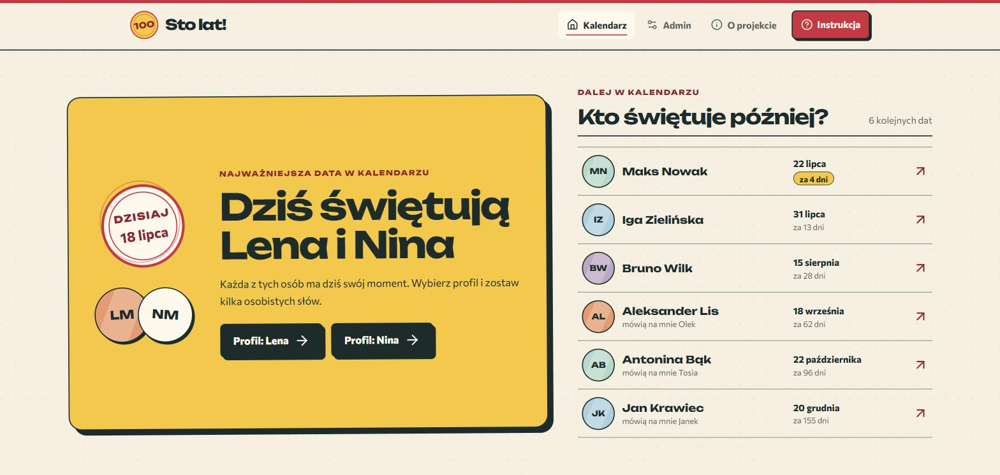
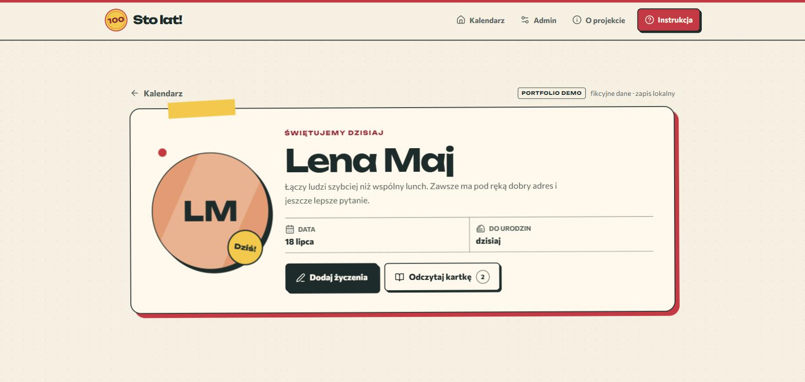
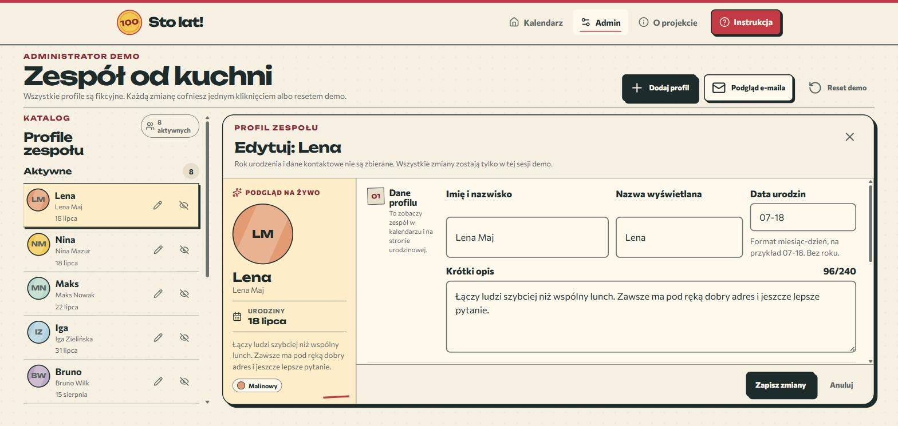
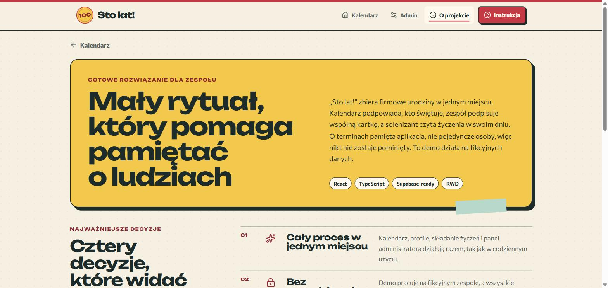

# Sto lat!

Public portfolio demo: a company birthday calendar with private wish
cards. The app reminds the team who celebrates next, walks everyone
through signing short wishes and shows them to the birthday person on
their day. An admin workspace for managing profiles completes the loop.

The idea is organizational, not technical. The app remembers the dates,
not individual people, so nobody gets skipped. Instead of an accidental
chat message, the team gets a shared ritual: anyone can leave a few
personal words in under a minute, and the celebrant reads everything on
one card.

**Live demo: [to be added after the Netlify deploy]**

Author: **Tomasz Zapiór** ·
[LinkedIn](https://www.linkedin.com/in/tomasz-zapi%C3%B3r)

[](https://github.com/tomekzapior/100lat/actions/workflows/quality.yml)

[Wersja polska](README.md) — the product UI is in Polish.



## The twist: a demo that is never empty

A birthday calendar tied to fixed dates dies on every day when nobody
celebrates. This demo doesn't:

- the dataset is generated **relative to the day you open the app**
  ([`src/data/demoSeed.ts`](src/data/demoSeed.ts)): two people always
  celebrate today, the next birthday is four days away, the rest spread
  across the year;
- when the day changes, the state re-seeds automatically, and corrupted
  session data is rejected by full validation
  ([`src/data/parseDemoState.ts`](src/data/parseDemoState.ts)) with a safe
  fallback to the seed;
- every change (new profiles, wishes, photos) lives in the browser
  session and one button restores the initial dataset;
- on a birthday the home page fires confetti and the celebrant's profile
  fireworks; both effects are particle-capped, pause in a hidden tab and
  switch off entirely under `prefers-reduced-motion`.

A recruiter always lands mid-action: there is someone to write to, a card
to open and data to manage.

## What this project demonstrates

- Product thinking: the rules such an app actually needs (one entry per
  author per card per year, early wishes land on the correct celebration
  year, the last admin cannot lose the role), written into the PRD and
  enforced in code.
- A designed system, not a template: a screen-printed birthday card
  metaphor, OKLCH tokens, date stamps, tape details, two variable
  typefaces (Unbounded and Commissioner) and a custom Canvas celebration
  engine.
- A resilient data layer: state validation at the session boundary,
  in-browser image compression before saving and an explicit warning when
  `sessionStorage` writes fail, instead of a false success.
- Testable logic and UI: dates with 29 February and the year boundary,
  corrupted-state validation, full admin CRUD and the main flows,
  26 Vitest tests in total.
- Responsive discipline: no horizontal scroll from 320 px, a 7/5 desktop
  composition from 1120 px, the largest scale reserved for 1920+ screens.
- A Supabase/PostgreSQL schema with RLS and restricted views ready in
  [`supabase/migrations`](supabase/migrations); wiring it into the same
  domain interface is the next milestone.

## Screens

| | |
|---|---|
|  Home: today's celebration and the calendar |  Celebrant profile with the wish flow entry |
|  Admin: catalog and editing with live preview |  Project page: decisions and repo contents |

## How to test it

No account needed. The codes are deliberately public and described in the
app (the **Instrukcja** button):

- member code (wishes): `2026`
- admin code: `4242`

Three scenarios: write wishes from a celebrant's profile, open a card
with the member code, then enter the Admin section to add or hide a
profile. **Przywróć dane demo** (restore demo data) reverts all session
changes.

## Design direction: a screen-printed card

Warm paper instead of white, ink instead of black, a raspberry brand
accent and yellow reserved for celebration: today's hero, date stamps,
"soon" pills for birthdays within seven days. Layers look taped to the
page and buttons cast hard offsets instead of blurred shadows.

- Display face: **Unbounded Variable** for names, stamps and headlines.
- Text face: **Commissioner Variable** for content and forms.
- OKLCH tokens and style layers in [`src/styles`](src/styles)
  (base, pages, admin, responsive).
- Motion uses transform/opacity only and is fully disabled under
  `prefers-reduced-motion`.

## How the demo maps to the full build

| Demo (this repo, in the browser) | Full build (next stage) |
|---|---|
| Fictional identity picker and public codes | Supabase Auth with profiles linked to employees |
| State in `sessionStorage` with validation and re-seed | Postgres with RLS, column grants and restricted views |
| In-browser avatar compression (canvas, JPEG) | Storage bucket with size limits and per-employee paths |
| One-entry-per-year rule computed client-side | Unique `recipient + author + year` index in the database |
| E-mail reminder preview without sending | Resend triggered on a schedule via a Supabase Edge Function |
| Last-admin protection in the data layer | The same rule as a database policy and trigger |

The SQL for the right column already exists:
[`supabase/migrations`](supabase/migrations), and the environment
contract lives in [`.env.example`](.env.example).

## Stack

Vite · React 19 · TypeScript (strict) · a custom CSS system on OKLCH
tokens (Tailwind v4 tooling) · React Router · Vitest · oxlint ·
lucide-react · variable fonts via @fontsource. Beyond React, the router
and icons there are zero runtime dependencies.

## Run locally

```bash
npm install
npm run dev        # http://127.0.0.1:5173
```

## Commands

```bash
npm run dev         # dev server
npm run typecheck   # tsc, strict mode
npm run lint        # oxlint
npm test            # vitest
npm run build       # production build
```

## Environment variables

The demo runs with no variables at all. [`.env.example`](.env.example)
documents the contract for the future Supabase adapter and server-side
secrets (Resend, service role). Never commit `.env` or real keys; server
values never get the `VITE_` prefix.

## Tests

- `src/lib/dates.test.ts`: 29 February, year rollover, celebration year
  for wishes written ahead of time, distance labels, Polish-character
  normalization.
- `src/lib/validation.test.ts`: field limits and messages for wishes and
  profiles.
- `src/data/parseDemoState.test.ts`: rejecting corrupted session state
  (wrong version, broken date, unknown enum, dangling person reference).
- `src/App.test.tsx`: celebrations, reduced motion, the full wish flow,
  card reading, admin CRUD with undo, last-admin protection, corrupted
  session fallback and the failed-persistence warning.

## Product documentation

All documents are written in Polish:

- [Product requirements (PRD)](docs/prd.md)
- [Design brief](docs/design-brief.md)
- [Design guide](docs/design-guide.md)
- [Quality audit](docs/audit-report.md)
- [Supabase guide](docs/supabase-guide.md)

## Note

This is not an anonymized copy of any company project. It is a public
demo written from scratch, inspired by a general class of problem:
workplace birthdays, private wishes and lightweight team administration.
All people, photos and entries are fictional.
